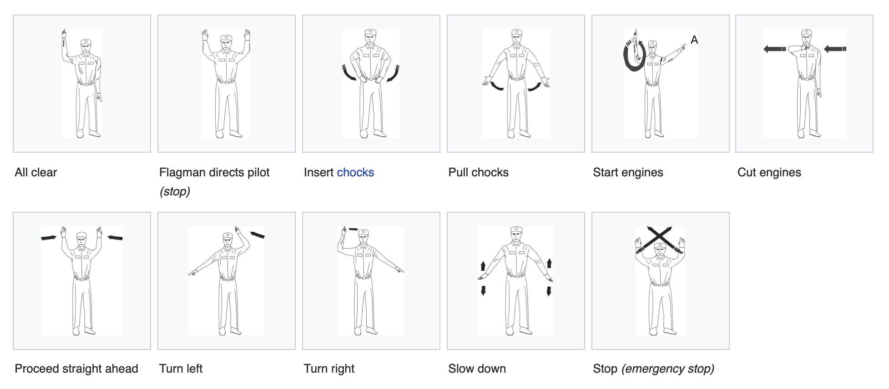

# Mapping Human Poses for AI Applications

## Overview

The purpose of this project is to produce a body-motion tracking and recognition system that enables movements of the human body to be identified. The system will describe extensively and completely the motion of the human body in a notation that will be passed into a machine learning model to recognize various motions and poses. These poses will then be labeled and identified by the system to relay useful information about the motion. For example, with ground traffic control signals at the airport, the system could recognize the particular directives of the ground crew, and relay this information to the pilot or planes computer system.

Our goal is to visually identify and track human poses and movements. These identifications will be used to relay useful information about human signals to someone who is out of viewing range. We are looking to use Microsoft’s Azure Kinect to achieve our goal because it has great documentation, as well as compatibility with our hardware.

## Background

### Aircraft Marshalling Signals

Aircraft signals vary slightly among the North Atlantic Treaty Organization (NATO) Standardization Agreement 3117, Air Standardization Coordinating Committee Air Standard 44/42A, the Appendix 1 of the Annex 2 to the Chicago Convention on International Civil Aviation, and Federal Aviation Administration (FAA) signals. the US Air Force generally follows ICAO guidance if its guidance conflicts with FAA, ICAO, or NATO documents. The ICAO defines numerous important codes for use in international aviation.



## Functionality

## Microsoft Azure Kinnect SDK

### Minimum host PC hardware requirements
The PC host hardware requirement is dependent on application/algorithm/sensor frame rate/resolution executed on host PC. Recommended minimum Sensor SDK configuration for Windows is:
  
  ```
  - Seventh Gen Intel® CoreTM i3 Processor (Dual Core 2.4 GHz with HD620 GPU or faster)
  
  - 4 GB Memory
  
  - Dedicated USB3 port
  
  - Graphics driver support for OpenGL 4.4 or DirectX 11.0
  
  - Lower end or older CPUs may also work depending on your use-case.
  ```
  
Performance differs also between Windows/Linux operating systems and graphics drivers in use.

### Body tracking host PC hardware requirements
The body tracking PC host requirement is more stringent than the general PC host requirement. Recommended minimum Body Tracking SDK configuration for Windows is:
  
  ```
  - Seventh Gen Intel® CoreTM i5 Processor (Quad Core 2.4 GHz or faster)
  
  - 4 GB Memory
  
  - NVIDIA GEFORCE GTX 1070 or better
  
  - Dedicated USB3 port
  ```

[Azure Kinect SDK Documentation](https://docs.microsoft.com/en-us/azure/Kinect-dk/)

[Azure Kinect Sensor SDK Download](https://docs.microsoft.com/en-us/azure/Kinect-dk/sensor-sdk-download)

[Azure Kinect Body Tracking SDK Download](https://docs.microsoft.com/en-us/azure/Kinect-dk/body-sdk-download)


## Installation

## Usage

### Using k4abt_data_collect.cpp

In order to use the Azure Kinect Body Tracking data collection functions, include k4abt_data_collect.h to access relevant functions. To use the `k4abt_skeleton_t` structure include `k4abt.h`. For other Azure Kinect Sensor API usage include `k4a/k4a.h`.
  
  #### Required Functions Calls
  - Must call `init_device()` first to set up the Azure Kinect DK.
  - Next call `init_bt()` to set up the Azure Kinect Body Tracking Engine.
  - To collect body skeleton data use the `get_device_bt_capture()` function. 
      - This function will place a single body skeleton in the `k4abt_skeleton_t*` 
        pointer reference passed in to the functions third parameter. 
      - Call this function repeatedly to capture continuous body skeletons.
        See source code functions `do_one()` and `do_continuous()` for example usage.
  - Call `clean_up()` function to release and close utilized resources.
  
  #### Optional Functions Calls
  - Call `print_body_skeleton()` to output body skeleton data to console.
  - Call `parse_skeleton_to_txt()` in order to output body skeleton data to custom format text file.
  - Call `parse_txt_to_skeleton()` in order to read in body skeleton data from custom format text file.
  
  #### Externally Accesable Resources
  Device Capture Resources
    
    - `k4a_device_configuration_t device_config`      : Specifies Azure Kinect Sensor Configuration Structure
    - `k4a_capture_t device_capture`                  : Azure Kinect Sensor Capture Structure

  Body Tracking Resources
    
    - `k4abt_tracker_configuration_t tracker_config`  : Specifies Azure Kinect Body Tracker Configuration Structure
    - `k4abt_frame_t body_frame`                      : Azure Kinect Body Tracking Capture Used for Skeleton Detection
  
  
## Aknowlegements

